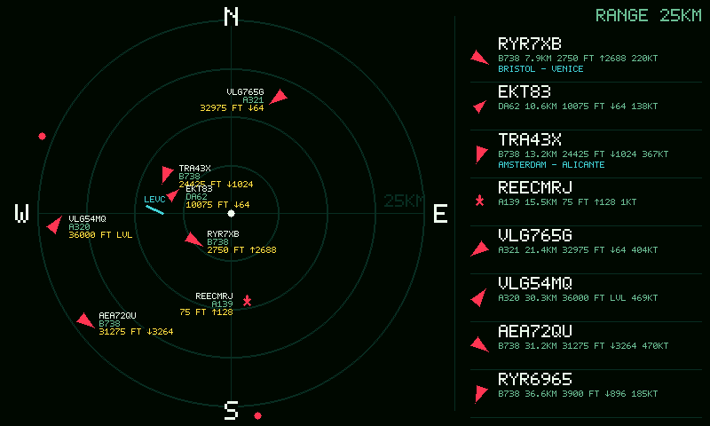

# Big Plane Radar

Firmware for the Waveshare ESP32-S3-Touch-LCD-7 display. It shows a live ADS-B
radar centered on a configurable location, with aircraft symbols, labels,
altitude, vertical speed, range rings, and a compact aircraft list.

The firmware does not use LVGL. It draws directly into an RGB565 framebuffer and
uses Waveshare's official `ESP32_Display_Panel` stack for the 800x480 RGB LCD and
GT911 touch panel.



## 3D-Printed Stand

A matching desktop stand for this display and firmware is available on
MakerWorld:

https://makerworld.com/ru/models/3034679-stand-for-esp32-s3-touch-lcd-7-for-plane-radar

## Hardware

- Waveshare ESP32-S3-Touch-LCD-7, 800x480 RGB LCD
- USB data cable connected to the board's `UART1` USB port
- Board switch set to `UART1`

On macOS, install the USB serial driver if the board does not appear as
`/dev/cu.usbmodem*` or `/dev/cu.wchusbserial*`. On Linux, the device usually
appears as `/dev/ttyACM*` or `/dev/ttyUSB*`; the user may need access to the
`dialout` group.

## Features

- first-boot setup portal: `PlaneRadar-Setup`;
- saved Wi-Fi, radar center, units, runway overlay, and range settings in NVS;
- ADS-B data from `https://opendata.adsb.fi/api/v3/`;
- local dead-reckoning between ADS-B updates, redrawn at about `4 FPS`;
- optional route city line in the aircraft list via cached callsign lookups from
  `https://api.adsbdb.com/`;
- optional Stadia Maps `Alidade Smooth Dark` raster background, with a complete
  no-map fallback;
- all four map ranges are downloaded once during boot and cached in PSRAM, so
  changing radar range performs no additional Stadia request;
- downloaded maps are bilinearly downsampled to the display for smoother roads
  and boundaries;
- with a map loaded, aircraft use the full rectangular map viewport and
  out-of-view targets become direction dots on its edge; without a map, the
  original circular radar boundary remains unchanged;
- background Wi-Fi reconnect after router/power outages;
- touch controls: short tap cycles range, long press starts the setup portal;
- boot setup window: hold the screen during startup to force the setup portal;
- screenshot endpoint: `/screenshot` and `/screenshot.bmp`;
- conservative RGB LCD settings for this panel: `14 MHz` PCLK and `800 * 10`
  RGB bounce buffer.

## Symbol Legend

Aircraft symbols use ADS-B `category` when it is available.


## Repository Layout

```text
.
├── big_plane_radar.ino
├── build_arduino_cli.sh
├── esp_panel_board_custom_conf.h
├── lib/
│   ├── ArduinoJson/
│   └── PNGdec/
├── releases/
├── scripts/
│   └── build_iata_airports.py
├── src/
│   ├── airports.h
│   ├── airports_iata.h
│   ├── map_background.cpp
│   ├── map_background.h
│   ├── main.cpp
│   ├── panel_display.cpp
│   └── panel_display.h
└── vendor/
    └── waveshare-libraries/
```

`vendor/waveshare-libraries` contains only the Arduino libraries required by this
firmware: `ESP32_Display_Panel`, `ESP32_IO_Expander`, and `esp-lib-utils`.

## Install Tools

Install:

- `arduino-cli`
- Espressif Arduino core for ESP32
- `esptool` for manual flashing or diagnostics

Install the ESP32 core:

```sh
arduino-cli core update-index
arduino-cli core install esp32:esp32
```

## Build

```sh
bash build_arduino_cli.sh
```

By default, no Wi-Fi credentials are compiled into the firmware. The default
radar center is London:

```text
Latitude:  51.507400
Longitude: -0.127800
```

You can override first-boot defaults at build time:

```sh
DEFAULT_LAT=51.507400 \
DEFAULT_LON=-0.127800 \
bash build_arduino_cli.sh
```

Optional Wi-Fi defaults:

```sh
DEFAULT_WIFI_SSID="YourNetwork" \
DEFAULT_WIFI_PASSWORD="YourPassword" \
bash build_arduino_cli.sh
```

The map background is disabled by default. To make Stadia the first-boot
default for a private build:

```sh
DEFAULT_MAP_PROVIDER=stadia \
DEFAULT_STADIA_API_KEY="YourStadiaApiKey" \
bash build_arduino_cli.sh
```

Do not commit API keys. Public builds should keep the default
`DEFAULT_MAP_PROVIDER=none`; the provider and key can also be set later in the
device setup page and are stored in NVS. If the key is empty or a map request
fails, the radar continues on its normal plain background.

When Stadia is enabled, boot downloads one image for each of the four range
presets. The images remain in PSRAM until restart. They are refreshed only on
the next boot, including after changing the radar coordinates in setup. The
boot screen reports map progress as `1/4` through `4/4`; it shows `SKIP` when
maps are disabled and `NO KEY` when Stadia is selected without a key.

## Upload

Put the board switch into `UART1`, plug USB into the `UART1` port, then run:

```sh
UPLOAD=1 CLEAN=1 PORT=/dev/cu.usbmodem5AE71132621 bash build_arduino_cli.sh
```

Adjust `PORT` for your machine:

```sh
# macOS examples
PORT=/dev/cu.usbmodemXXXX
PORT=/dev/cu.wchusbserialXXXX

# Linux examples
PORT=/dev/ttyACM0
PORT=/dev/ttyUSB0
```

## Browser Flashing

You can also flash the board directly from a browser with Web Serial support.
Use Chrome, Edge, or another Chromium-based desktop browser. iOS browsers do not
support this workflow.

### Option A: Adafruit WebSerial ESPTool

This is the quickest no-hosting option because it lets you choose a local binary
file manually:

1. Open [Adafruit WebSerial ESPTool](https://adafruit.github.io/Adafruit_WebSerial_ESPTool/).
2. Set the board switch to `UART1` and plug USB into the `UART1` port.
3. Click `Connect` and select the ESP32-S3 serial port.
4. Use one file row:
   - offset: `0x0`
   - file: `releases/big_plane_radar.ino.merged.bin`
5. Click `Erase`, then `Program`.

Use the merged binary for browser flashing.

### Option B: ESP Web Tools Page

This repository includes a ready static installer in `web-installer/`. It uses
[ESP Web Tools](https://esphome.github.io/esp-web-tools/), which installs
firmware from a manifest and release binary.

To use it:

1. Publish this repository with GitHub Pages or another HTTPS static host.
2. Open:

```text
https://<your-github-user>.github.io/big_plane_radar/web-installer/
```

3. Press `Install Big Plane Radar` and select the ESP32-S3 serial port.

ESP Web Tools requires HTTPS and the firmware file must be fetchable by the
browser. The included manifest points to:

```text
../releases/big_plane_radar.ino.merged.bin
```

## First Boot

If no configuration is saved, the board starts a Wi-Fi access point:

```text
PlaneRadar-Setup
```

Connect to it and open:

```text
http://192.168.4.1
```

After the board joins your Wi-Fi, the setup page is also available at:

```text
http://plane-radar.local
```

Set Wi-Fi, radar center coordinates, units, runway overlay, and optional map
background there. Select `None` for the original plain radar, or select
`Stadia Alidade Smooth Dark` and enter a Stadia Maps API key. The board reboots
after saving.

The firmware uses the Stadia Maps Static Maps API and preserves the attribution
rendered into the returned map image. See the official
[Stadia Maps static map documentation](https://docs.stadiamaps.com/static-maps/).

## Screenshot

When the board is connected to Wi-Fi, capture the current screen:

```sh
curl -o docs/screenshot.bmp http://plane-radar.local/screenshot.bmp
```

Direct URLs:

```text
http://plane-radar.local/screenshot
http://plane-radar.local/screenshot.bmp
```

If mDNS is unavailable, use the IP shown in the setup page:

```sh
curl -o docs/screenshot.bmp http://<device-ip>/screenshot.bmp
```

## Release Binaries

Prebuilt files are placed in `releases/`:

- `big_plane_radar.ino.merged.bin`

Manual flashing can use the same merged binary:

```sh
esptool.py --chip esp32s3 --port /dev/cu.usbmodemXXXX --baud 921600 \
  write_flash 0x0 releases/big_plane_radar.ino.merged.bin
```

The easiest development path is still `UPLOAD=1 ... bash build_arduino_cli.sh`.
