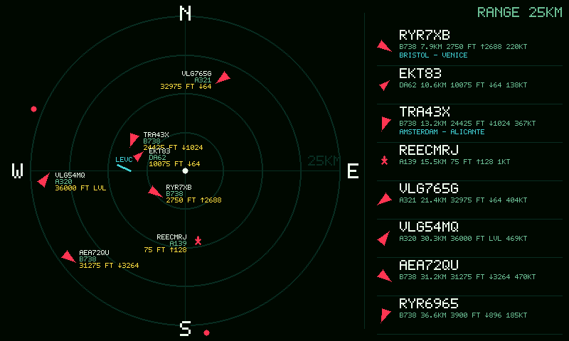

# Big Plane Radar

[Русская версия](README.ru.md)

Firmware for the Waveshare ESP32-S3-Touch-LCD-7 and ESP32-S3-Touch-LCD-7B
displays. It shows a live ADS-B radar centered on a configurable location, with
aircraft symbols, labels, altitude, vertical speed, range rings, and a compact
aircraft list.

The firmware does not use LVGL. It draws directly into an RGB565 framebuffer and
uses Waveshare's official `ESP32_Display_Panel` stack. One universal binary
detects the connected model before panel initialization and selects the correct
800x480 or 1024x600 RGB timings, touch bounds, map size, and interface layout.



## Quick Start (Recommended)

This is the easiest way to install Big Plane Radar on a new display. You do not
need Arduino IDE, `arduino-cli`, Python, or `esptool`.

### What you need

- a Waveshare ESP32-S3-Touch-LCD-7 or ESP32-S3-Touch-LCD-7B;
- a USB cable that supports data, not a charge-only cable;
- a Windows, macOS, or Linux computer with Google Chrome or Microsoft Edge;
- a 2.4 GHz Wi-Fi network and its password. ESP32-S3 cannot connect to a
  5 GHz-only network;
- optionally, a Stadia Maps API key if you want a map under the radar.

Phones, tablets, Safari, and Firefox cannot use the browser installer because
they do not provide the required Web Serial support.

### 1. Connect the display

1. Disconnect the display from USB.
2. Move the small UART selection switch on the board to `UART1`.
3. Connect the USB cable to the display connector marked `UART1` or
   `USB TO UART`. Do not use the neighboring native USB connector.
4. Connect the other end to the computer.

### 2. Install the firmware in your browser

1. Open the
   **[Big Plane Radar Web Installer](https://k4m454k.github.io/big_plane_radar/web-installer/)**
   in Chrome or Edge.
2. Click **Install Big Plane Radar**, then click **Connect**.
3. Select the new USB serial device from the list. It is normally named
   `USB Serial`, `CH343`, `wchusbserial`, or similar.
4. Confirm the installation and wait until it reaches 100%. Do not disconnect
   the cable during flashing.
5. Allow the installer to erase the device if it asks. The current installer
   writes a complete 16 MB merged image, so treat browser installation as a
   full reflash: saved Wi-Fi and radar settings may need to be entered again.
6. If the display does not restart automatically, press its `RESET` button once.

### 3. Prepare a map key (optional)

The radar works without a map. Skip this step and select `None` during setup if
you prefer the plain radar background.

To enable the map, do this before connecting your computer to the display's
setup Wi-Fi:

1. [Create a Stadia Maps account](https://client.stadiamaps.com/signup/).
2. Open the [Stadia Maps client dashboard](https://client.stadiamaps.com/).
3. Open **Manage Properties**, find **Authentication Configuration**, and
   generate an API key.
4. The firmware uses standard raster basemap tiles, which are available on the
   Stadia Maps Free plan. A paid Static Maps subscription is not required.
5. Keep the key available for the next step. Do not publish it in screenshots
   or commits.

### 4. Configure the radar

1. Wait for the display to create the Wi-Fi network `BigPlaneRadar-Setup`.
2. Connect the computer or phone to `BigPlaneRadar-Setup`. It has no password.
3. If the setup page does not open automatically, open
   **[http://192.168.4.1](http://192.168.4.1)**.
4. Enter the name and password of your 2.4 GHz Wi-Fi network.
5. Set the radar center to your location. Press **Use browser location**, or
   enter decimal latitude and longitude copied from a map application.
6. For a plain background, leave **Map background** set to `None`. For a map,
   select `Stadia Alidade Smooth Dark` and paste the API key from step 3.
7. Leave the other settings at their defaults for the first run.
8. Press **Save and reboot**.

`BigPlaneRadar-Setup` disappearing after **Save and reboot** is normal: the display
is switching to your home Wi-Fi.

If **Use browser location** cannot load while connected to `BigPlaneRadar-Setup`,
enter coordinates manually. You can change them later from
`http://bigplane-radar.local` after both devices are connected to your normal
Wi-Fi.

The first map-enabled boot downloads the XYZ tiles needed for four map views.
Keep the device powered and wait for `TILE CACHE` to finish view `4/4`; the
radar opens automatically afterwards. The boot log shows the view, XYZ tile,
zoom, dimensions, PNG size, download progress, and decode time.

### Everyday controls

- use `+` / `-` beside RANGE to change distance;
- tap an aircraft on the map or in the list to show its track, predicted path, and a detail card;
- tap the detail card (or the same list row again) to clear the selection;
- long-press the screen to reopen the setup portal;
- open [http://bigplane-radar.local](http://bigplane-radar.local) from the same Wi-Fi
  to change settings later, including METAR/clock options, aircraft tag size, and firmware updates.

### If something does not work

- **The installer cannot find the display:** use Chrome or Edge on a computer,
  check that both the switch and cable are on `UART1`, try another data cable,
  close serial-terminal applications, and reconnect USB.
- **No serial device appears:** the board uses a CH343 USB-to-UART chip. Install
  the official [WCH driver for macOS](https://www.wch-ic.com/downloads/CH341SER_MAC_ZIP.html)
  or [WCH driver for Windows](https://www.wch-ic.com/downloads/CH343SER_EXE.html),
  then reconnect the board. Modern Linux kernels normally include the driver.
- **Linux sees the port but the installer cannot open it:** add your user to
  the `dialout` group with `sudo usermod -aG dialout "$USER"`, sign out, and
  sign in again.
- **`BigPlaneRadar-Setup` does not appear:** press `RESET`, wait for the boot
  sequence, and hold a finger on the screen when the footer asks you to hold it
  for setup.
- **`bigplane-radar.local` does not open:** use the display's IP address from your
  router instead. For example, open `http://192.168.1.123`.
- **The boot screen says `NO KEY`:** a Stadia map was selected without a valid
  API key. Reopen setup and add the key or select `None`.
- **The radar is empty:** verify Wi-Fi and location, then try a wider range by
  tapping the radar.

Official board documentation:

- [ESP32-S3-Touch-LCD-7 wiki](https://docs.waveshare.com/ESP32-S3-Touch-LCD-7)
- [ESP32-S3-Touch-LCD-7B wiki](https://docs.waveshare.com/ESP32-S3-Touch-LCD-7B)

## 3D-Printed Stand

A matching desktop stand for this display and firmware is available on
MakerWorld:

https://makerworld.com/ru/models/3034679-stand-for-esp32-s3-touch-lcd-7-for-plane-radar

## Hardware

- Waveshare ESP32-S3-Touch-LCD-7, 800x480 RGB LCD, or
  ESP32-S3-Touch-LCD-7B, 1024x600 RGB LCD
- USB data cable connected to the board's `UART1` USB port
- Board switch set to `UART1`

The same firmware image supports both displays. At boot it probes the GT911
configuration and the 7B board controller before creating the RGB panel. The
original display keeps its 520+280 layout and 13 MHz PCLK; the 7B uses a
680+344 layout and Waveshare's official 30 MHz panel timing.

On macOS, install the USB serial driver if the board does not appear as
`/dev/cu.usbmodem*` or `/dev/cu.wchusbserial*`. On Linux, the device usually
appears as `/dev/ttyACM*` or `/dev/ttyUSB*`; the user may need access to the
`dialout` group.

## Features

- one universal firmware image with automatic ESP32-S3-Touch-LCD-7/7B
  detection and resolution-aware layout;
- first-boot setup portal: `BigPlaneRadar-Setup`;
- saved Wi-Fi, radar center, units, airport overlay, aircraft symbol style,
  aircraft label, map brightness, and range settings in NVS;
- automatic selection of the nearest one to three medium/large airports and all
  their physical runways;
- ADS-B data from `https://opendata.adsb.fi/api/v3/`;
- local dead-reckoning between 5-second ADS-B updates, redrawn continuously;
- up to 10 minutes of confirmed positions are retained per aircraft in PSRAM;
  tap an aircraft row to show its history track and a detail card on the right;
  tap the card (or the same row) to clear;
- magenta speed vectors in front of aircraft show the next ~60 seconds of
  ground track, independent of the selected history trail;
- local clock and METAR for the configured airport in the right-hand footer;
- selected aircraft are highlighted in green on the map, including off-screen dots;
- authenticated OTA firmware updates at `http://bigplane-radar.local/firmware`
  (user `admin`);
- optional route city line populated dynamically from cached callsign lookups at
  `https://api.adsbdb.com/`; no global city table is embedded in the firmware;
- optional Stadia Maps `Alidade Smooth Dark` raster-tile background using the
  Free plan, with a complete no-map fallback;
- configurable map brightness from 20% to 100%;
- all four map ranges are downloaded once during boot and cached in PSRAM, so
  changing radar range performs no additional Stadia request;
- downloaded maps are bilinearly downsampled to the display for smoother roads
  and boundaries;
- with a map loaded, aircraft use the full rectangular map viewport and
  out-of-view targets become direction dots on its edge; without a map, the
  original circular radar boundary remains unchanged;
- each aircraft label line has a tightly fitted black backing for readability
  without obscuring unnecessary map area;
- aircraft tags show the route pair on top when known, then callsign and type;
- independently configurable callsign, aircraft type, altitude, and vertical
  rate label fields; enabled lines automatically close any gaps;
- aircraft tag size on the radar map is adjustable from 100% to 200% in setup;
- the aircraft list and detail card show city names with ICAO codes when known;
- selectable anti-aliased detailed aircraft icons or the original classic
  triangle and rotorcraft symbols, with visual previews in the setup page;
- detailed icons are used consistently on the map and in the aircraft list;
  their 5-degree rotation frames are precomputed in flash and alpha-blended
  directly into the RGB565 framebuffer;
- background Wi-Fi reconnect after router/power outages;
- touch controls: `+`/`-` change range, tap an aircraft on the map or list to
  toggle its track, and long press to start the setup portal;
- boot setup window: hold the screen during startup to force the setup portal;
- screenshot endpoint: `/screenshot` and `/screenshot.bmp`;
- conservative RGB LCD settings for this panel: `13 MHz` PCLK and `800 * 10`
  RGB bounce buffer.

## Symbol Legend

Aircraft symbols use ADS-B `category` when it is available. Detailed and classic
modes share the same three aircraft size classes and rotorcraft detection. The
legend below compares both styles.


## Repository Layout

```text
.
├── assets/
│   └── icons/
├── big_plane_radar.ino
├── build_arduino_cli.sh
├── esp_panel_board_custom_conf.h
├── location.html
├── lib/
│   ├── ArduinoJson/
│   └── PNGdec/
├── releases/
├── scripts/
│   ├── build_aircraft_icons.py
│   └── update_airport_data.py
├── src/
│   ├── aircraft_icon_data.inc
│   ├── aircraft_icons.cpp
│   ├── aircraft_icons.h
│   ├── airport_catalog.h
│   ├── map_background.cpp
│   ├── map_background.h
│   ├── main.cpp
│   ├── panel_display.cpp
│   └── panel_display.h
└── vendor/
    └── waveshare-libraries/
```

`vendor/waveshare-libraries` contains only the Arduino libraries required by this
firmware: `ESP32_Display_Panel`, `ESP32_IO_Expander`, and `esp-lib-utils`.

The generated aircraft icon atlas is committed, so a normal firmware build does
not require Pillow. Rebuilding it after changing the source PNG files requires
Pillow (`python3 -m pip install Pillow`):

```sh
python3 scripts/build_aircraft_icons.py
```

## Airport Data

The generated catalog contains only airports and runways. Route cities come
dynamically from ADSBdb and are cached in RAM, while the setup page selects only
the nearest one to three airports for map rendering. Users do not need to
generate data manually.

See the complete [airport data and generation guide](docs/AIRPORT_DATA.md).
[Russian version](docs/AIRPORT_DATA.ru.md).

## Build From Source (Developers)

Everything below is only needed to modify or build the firmware. For a normal
installation, use the browser-based Quick Start above.

### Install tools

Install:

- `arduino-cli`
- Espressif Arduino core for ESP32
- `esptool` for manual flashing or diagnostics

Install the ESP32 core:

```sh
arduino-cli core update-index
arduino-cli core install esp32:esp32
```

### Build

The release firmware uses Espressif's pinned high-performance SDK for stable RGB
panel operation:

```sh
bash build_arduino_highperf.sh
```

The first run downloads and verifies the Espressif `3.2.0-h` SDK (about 343 MB)
and installs an isolated Arduino Core 3.2.0 environment under the user cache. It
does not replace the system Arduino Core. The build enables O2, PSRAM XIP, a
64-byte cache line, and 80 MHz Octal PSRAM.

For development with the system Arduino Core, use `bash build_arduino_cli.sh`.

The default `LOG_LEVEL=info` keeps only errors and important one-time events in
Serial. Use a debug build when diagnosing boot, networking, map loading, or frame
timing:

```sh
LOG_LEVEL=debug bash build_arduino_highperf.sh
```

Supported levels are `off`, `error`, `info`, and `debug`. Disabled application
logs are removed at compile time; the build script also reduces the ESP32 core
log level accordingly.

By default, no Wi-Fi credentials are compiled into the firmware. The default
radar center is London:

```text
Latitude:  51.507400
Longitude: -0.127800
```

You can override first-boot defaults at build time:

```sh
DEFAULT_LAT=51.507400 \
DEFAULT_LON=-0.127800 \
bash build_arduino_highperf.sh
```

Optional Wi-Fi defaults:

```sh
DEFAULT_WIFI_SSID="YourNetwork" \
DEFAULT_WIFI_PASSWORD="YourPassword" \
bash build_arduino_highperf.sh
```

The map background is disabled by default. To make Stadia the first-boot
default for a private build:

```sh
DEFAULT_MAP_PROVIDER=stadia \
DEFAULT_STADIA_API_KEY="YourStadiaApiKey" \
bash build_arduino_highperf.sh
```

Do not commit API keys. Public builds should keep the default
`DEFAULT_MAP_PROVIDER=none`; the provider and key can also be set later in the
device setup page and are stored in NVS. If the key is empty or a map request
fails, the radar continues on its normal plain background.

When Stadia is enabled, boot downloads and assembles the 256x256 XYZ tiles
needed for each of the five range presets. The rendered views remain in PSRAM
until restart. They are refreshed only on the next boot, including after
changing the radar coordinates in setup. The boot log reports both view and
XYZ-tile progress; it shows `SKIP` when maps are disabled and `NO KEY` when
Stadia is selected without a key.

### Upload over USB

Put the board switch into `UART1`, plug USB into the `UART1` port, then run:

```sh
UPLOAD=1 CLEAN=1 PORT=/dev/cu.usbmodem5AE71132621 bash build_arduino_highperf.sh
```

Adjust `PORT` for your machine:

```sh
# macOS examples
PORT=/dev/cu.usbmodemXXXX
PORT=/dev/cu.wchusbserialXXXX

# Linux examples
PORT=/dev/ttyACM0
PORT=/dev/ttyUSB0
```

## Browser Flashing

Browser flashing is the recommended installation method. Use Chrome, Edge, or
another Chromium-based desktop browser with Web Serial support.

### Hosted installer (recommended)

Open the
**[Big Plane Radar Web Installer](https://k4m454k.github.io/big_plane_radar/web-installer/)**,
press **Install Big Plane Radar**, and select the ESP32-S3 serial port. The page
uses [ESP Web Tools](https://esphome.github.io/esp-web-tools/) and always installs
the merged binary published with this repository.

### Manual browser fallback

If the hosted installer is unavailable:

1. Open [Adafruit WebSerial ESPTool](https://adafruit.github.io/Adafruit_WebSerial_ESPTool/).
2. Set the board switch to `UART1` and plug USB into the `UART1` port.
3. Click `Connect` and select the ESP32-S3 serial port.
4. Download
   [`big_plane_radar.ino.merged.bin`](https://github.com/k4m454k/big_plane_radar/releases/latest/download/big_plane_radar.ino.merged.bin).
5. Use one file row:
   - offset: `0x0`
   - file: the downloaded `big_plane_radar.ino.merged.bin`
6. Click `Erase`, then `Program`.

Use the merged binary for browser flashing.

## Setup Page Reference

The setup page is available at `http://192.168.4.1` while connected to
`BigPlaneRadar-Setup`, or at `http://bigplane-radar.local` after the board joins your
normal Wi-Fi. It controls the radar center, units, airport/runway selection,
aircraft symbol style, label fields, map brightness, and map background.

`Use browser location` fills the coordinate fields using the browser's precise
location. Browsers allow geolocation only from a secure context, while the ESP
setup page is served over local HTTP. The button therefore opens the repository's
hosted HTTPS `location.html` helper and returns the coordinates to the local
setup page.

The firmware uses Stadia Maps raster XYZ tiles available on the Free plan. It
assembles and bilinearly scales the tiles on the ESP32, and draws the required
Stadia Maps, OpenMapTiles, and OpenStreetMap attribution over the map. See the official
[API-key instructions](https://docs.stadiamaps.com/authentication/) and
[Raster Map Tiles documentation](https://docs.stadiamaps.com/raster/).

## Screenshot

When the board is connected to Wi-Fi, capture the current screen:

```sh
curl -o docs/screenshot.bmp http://bigplane-radar.local/screenshot.bmp
```

Direct URLs:

```text
http://bigplane-radar.local/screenshot
http://bigplane-radar.local/screenshot.bmp
```

If mDNS is unavailable, use the IP shown in the setup page:

```sh
curl -o docs/screenshot.bmp http://<device-ip>/screenshot.bmp
```

## Firmware updates (OTA)

After this dual-OTA partition table is installed once over USB or the web
installer, later updates can use the setup page:

1. Open [http://bigplane-radar.local](http://bigplane-radar.local) (or the device IP).
2. Open **Firmware update**.
3. Sign in with username `admin` and the OTA password (`plane-radar` unless you
   changed it).
4. Upload the application image (`big_plane_radar.ino.bin` from a source
   build). Do not upload `.merged.bin`.

The first flash of this firmware must be a full image at offset `0x0` because
the partition table changed from a single 3 MB app to two 3 MB OTA slots.

## Release Binaries

Prebuilt files are placed in `releases/`:

- `big_plane_radar.ino.merged.bin`

Manual flashing can use the same merged binary:

```sh
esptool.py --chip esp32s3 --port /dev/cu.usbmodemXXXX --baud 921600 \
  write_flash 0x0 releases/big_plane_radar.ino.merged.bin
```

The recommended release-equivalent path is
`UPLOAD=1 ... bash build_arduino_highperf.sh`.
